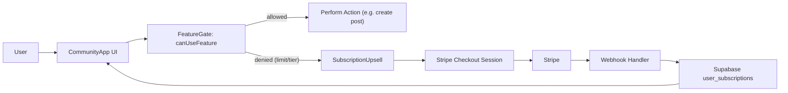

## Community subscription tiers & feature gating

### High-level approach

- **Goal**: Introduce four subscription tiers (Free, Pro, Developer, Business) for the community app, with a scalable way to gate features and manage limits, powered by Stripe subscriptions and an admin configuration UI.
- **Scope**: Implement for the community app only to start, but design the data model and services so they can be reused by other apps later.

### 1. Data model & backend foundations

- **Subscription tier enum & metadata**
  - Define a canonical enum for tiers (e.g. `"free" | "pro" | "developer" | "business"`) in a shared TypeScript module in the community app, e.g. `[apps/community/src/lib/subscriptions.ts](apps/community/src/lib/subscriptions.ts)`.
  - Add a `SubscriptionTier` TypeScript type and helper mappers (e.g. from Stripe price IDs → internal tier keys).
- **Supabase schema changes**
  - Extend the user profile-related table (or create a dedicated `user_subscriptions` table) to track:
    - Internal tier (`tier`), current status (`active`, `past_due`, `canceled`, `trialing`), and source (`stripe` for now).
    - Stripe identifiers: `stripe_customer_id`, `stripe_subscription_id`, `stripe_price_id`.
    - Timestamps: `current_period_start`, `current_period_end`, `cancel_at_period_end`.
  - Ensure RLS policies allow users to read their own subscription row and admins to read/write for all users.
  - Add basic indices on `user_id` and `stripe_subscription_id`.
- **Usage tracking for limits**
  - Confirm / leverage existing tables for blog posts and discussion posts in the community app.
  - Add indexes to support fast count queries per user:
    - `blog_posts(user_id, created_at)` (or equivalent author column).
    - `discussion_threads(user_id, created_at)` or similar.

### 2. Feature configuration model (scalable gating)

- **Feature registry**
  - Create a central feature definition map in `[apps/community/src/lib/feature-flags.ts](apps/community/src/lib/feature-flags.ts)` with types like:
    - `FeatureKey` union (e.g. `"blog.posts.max_count"`, `"discussions.posts.max_count"`, `"homepage.featured_posts"`, `"beta.developer_perks"`).
    - `FeatureConfig` defining per-tier rules (boolean flags, numeric limits, descriptions).
  - Represent features as either:
    - **Boolean access**: e.g. `canHaveFeaturedPosts`, `hasDeveloperPerks`.
    - **Numeric limits**: e.g. `maxBlogPosts`, `maxDiscussionPosts`.
- **Source of truth & overrides**
  - Define default feature configs in code (versioned, strongly typed) for all tiers.
  - Prepare a `feature_overrides` table in Supabase to support admin overrides per feature and tier, with schema like: `feature_key`, `tier`, `value` (JSONB), `updated_by`, timestamps.
  - Implement a loader in the community app that merges default config with DB overrides to produce an effective `FeatureMatrix` used throughout the app.

### 3. Runtime enforcement of feature gating

- **Server-side helpers**
  - Implement helpers in `[apps/community/src/lib/subscription-access.ts](apps/community/src/lib/subscription-access.ts)`:
    - `getUserSubscription(userId)`: fetch subscription/tier from Supabase.
    - `getEffectiveFeatureConfig(tier)`: pull merged feature configuration for a given tier.
    - `canUseFeature({ userId, featureKey, usageCount? })`: resolve access decisions (boolean, with optional limit checks) and return a structured result (allowed/denied, reason, limit metadata).
  - Use these helpers from server actions / routes that create blog posts or discussions to enforce limits on Free tier.
- **Client-side helpers & hooks**
  - Build a React hook `useSubscription()` that provides the current user’s tier, status, and feature matrix, fetched from an API route or a server component prop.
  - Build `useFeatureAccess(featureKey, options?)` to compute current user access and convenience booleans like `canCreateMoreBlogPosts`.
  - Ensure client logic is only for UX; treat server-side checks as the source of truth.

### 4. Admin UI for configuring feature access

- **Admin API endpoints / server actions**
  - Add endpoints or server actions scoped to admin users for:
    - Reading the effective feature matrix with defaults and overrides.
    - Creating/updating `feature_overrides` per tier and feature.
    - Optionally resetting a feature back to default.
- **Dashboard admin page enhancements**
  - Expand `[apps/community/src/app/dashboard/admin/page.tsx](apps/community/src/app/dashboard/admin/page.tsx)` to include a "Subscription & Features" section.
  - UI layout:
    - Tier selector (tabs for Free, Pro, Developer, Business).
    - For each tier, show a structured list/table of features:
      - Name, description, default value, current value (with diff if overridden).
      - Control type based on feature (toggle for boolean, numeric input for limits).
    - Save / Reset buttons with optimistic updates and error feedback.
  - Show separate category groups (Content Limits, Visibility & Promotion, Experimental Developer/Business perks) for scalability as the feature list grows.

### 5. Stripe integration for billing

- **Stripe account & products setup**
  - In Stripe, define one Product for the community subscription with four Prices (monthly and optionally yearly for each tier: Pro, Developer, Business; Free has no Stripe price).
  - Map each price ID to an internal `{ tier, billingInterval }` via a config in `[apps/community/src/lib/stripe-config.ts](apps/community/src/lib/stripe-config.ts)`.
- **Backend integration (likely in a shared API or community app server)**
  - Add a secure endpoint / server action to create a Stripe Checkout Session for upgrading a user:
    - Accepts requested tier & interval, verifies it’s allowed, and uses Stripe SDK to create Checkout.
    - Embed metadata: `user_id`, current tier, and any contextual info.
  - Implement Stripe webhook handler in the backend (e.g. in an api route under community app or a central API service):
    - Handle events: `checkout.session.completed`, `customer.subscription.created`, `customer.subscription.updated`, `customer.subscription.deleted`.
    - Upsert `user_subscriptions` rows based on Stripe data; maintain idempotency using event IDs.
  - Store Stripe customer ID in Supabase on first subscription and reuse for subsequent upgrades.
- **Security & RLS**
  - Ensure webhook route is not behind user auth but is protected by Stripe’s signing secret.
  - All user-facing API routes must ensure the authenticated user is acting on their own subscription.

### 6. User subscription management & portal

- **User-facing dashboard section**
  - Extend the community dashboard (e.g. `[apps/community/src/app/dashboard/page.tsx](apps/community/src/app/dashboard/page.tsx)`) to include a "Subscription" card:
    - Display current tier, billing interval, renewal date, and key benefits.
    - Buttons for "Manage subscription" (Stripe customer portal) and "Change plan".
  - On backend, implement a route to create a Stripe billing portal session:
    - Returns a URL that the client can redirect the user to, restricted to the logged-in user.
- **Upgrade / downgrade flows**
  - From the Subscription card and other upgrade CTAs, call the "create checkout session" endpoint for the selected tier.
  - After successful checkout, redirect user back to the community app, which will read updated subscription info from Supabase and update UI accordingly.
  - For downgrades: rely on Stripe portal to manage plan changes, but read resulting tier from webhooks and adjust features accordingly.

### 7. Upgrade prompts & marketing surfaces

- **Plan comparison / pricing modal**
  - Build a reusable `SubscriptionUpsell` component in `[apps/community/src/components/subscriptions/SubscriptionUpsell.tsx](apps/community/src/components/subscriptions/SubscriptionUpsell.tsx)`:
    - Shows cards for Free, Pro, Developer, Business with key bullet points.
    - Highlights user’s current tier and visually emphasizes upgrade options.
    - Integrates upgrade buttons that trigger the Stripe Checkout flow.
  - Use this component in:
    - Dashboard subscription card (primary surface).
    - Contextual upgrade modals when a user hits a limit (e.g. attempts to create more than allowed blog posts or discussions on Free).
- **Contextual guardrail UX**
  - When user is blocked by a feature gate (e.g. Free limit exceeded), present:
    - Clear message explaining the limit and their current usage.
    - Prominent upgrade CTA (opening `SubscriptionUpsell` or directly starting checkout for Pro tier).

### 8. Initial configuration for the four tiers

- **Default semantics (aligned with your description)**
  - Free:
    - `maxBlogPosts`: a conservative default (e.g. 3–5) — stored as a default but overrideable in the admin UI.
    - `maxDiscussionPosts`: similar conservative default.
    - `canHaveFeaturedPosts`: false.
  - Pro:
    - `maxBlogPosts`: `Infinity` semantic (represented as `null` or a large sentinel value) – unlimited.
    - `maxDiscussionPosts`: unlimited.
    - `canHaveFeaturedPosts`: true.
  - Developer:
    - Same as Pro for now.
    - Additional boolean flags for future perks (e.g. `hasDeveloperPerks`) set to true but not yet wired to specific features.
  - Business:
    - Same as Pro for now.
    - Additional boolean flags for future business-only perks (e.g. `hasBusinessPerks`).
- **Config strategy**
  - Implement the default config as TypeScript constants and expose them via the admin UI so you can tweak limits and perks without redeploys.

### 9. Observability, testing, and rollout

- **Metrics & logging**
  - Log key events: subscription created/updated/canceled, feature-gate denials, upgrade funnel entry points.
  - Optionally add basic analytics to measure which features drive upgrades.
- **Testing strategy**
  - Unit tests for feature config merging and `canUseFeature` logic.
  - Integration tests (or manual scenarios) for:
    - Free tier hitting content limits and seeing upgrade prompts.
    - Successful Stripe checkout upgrading a user and unlocking features.
    - Downgrade via Stripe portal correctly constraining features.
- **Rollout plan**
  - Phase 1: Implement data model, feature registry, and admin UI with mock subscription tiers (no billing yet) to validate gating logic.
  - Phase 2: Integrate Stripe (checkout + webhooks + portal) and connect to same subscription data.
  - Phase 3: Turn on user-facing upgrade surfaces and start enforcing Free tier limits in production.

### 10. Mermaid overview – flow from feature use to billing

